## 第一章 计算机抽象及相关技术

**CPI：** 执行每条指令所需的平均时钟周期数

**SPEC分值** = 参考时间 / 执行时间

阿姆达尔定律：改进的部分占p，优化后：1-p + p/s（阿姆达尔定律：改进后的执行时间 = 改进部分执行时间÷改进部分的改进倍数 + 未改进部分执行时间）

评价性能：相同的功能下，时间短的性能就高

## 第二章 指令：计算机的语言

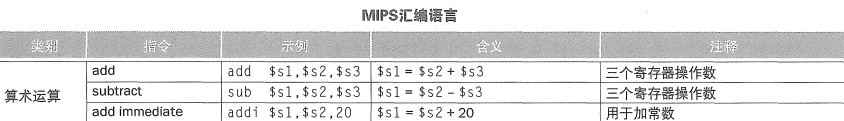

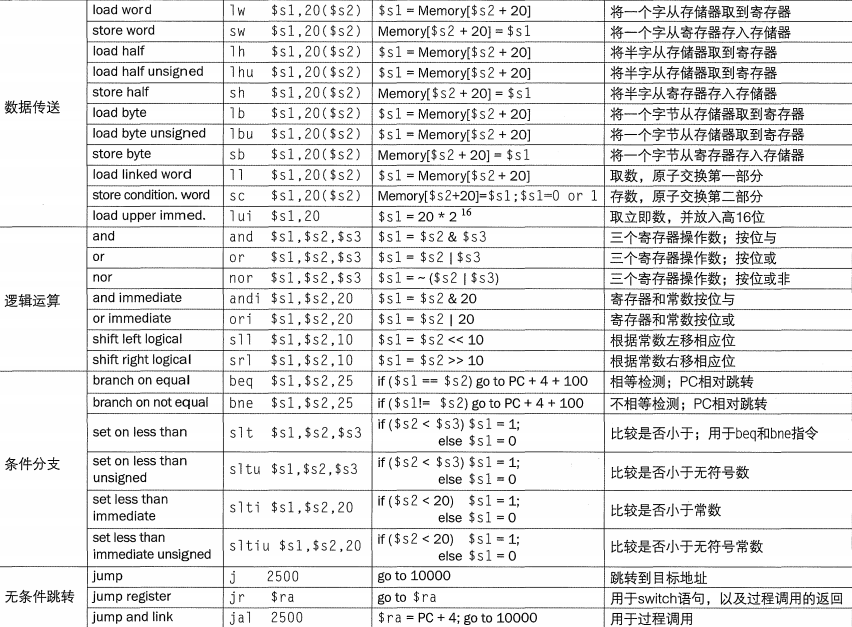

### 符号扩展：

对有符号数，低位直接复制，高位全部填充为符号位

### MIPS字段（32位）：

**R型指令**格式：

用于寄存器，指令的后半部分是三个字段

| op     | rs                   | rt                   | rd                       | shamt                                         | funct                  |
| ------ | -------------------- | -------------------- | ------------------------ | --------------------------------------------- | ---------------------- |
| 6位    | 5位                  | 5位                  | 5位                      | 5位                                           | 6位                    |
| 操作码 | 第一个源操作数寄存器 | 第二个源操作数寄存器 | 存放操作结果的目的寄存器 | 位移量（在移位指令中用到，移位时空出的位填0） | 功能码（进行何种运算） |

**I型指令**格式：

用于立即数

| op   | rs   | rt   | constant或address |
| ---- | ---- | ---- | ----------------- |
| 6位  | 5位  | 5位  | 16位              |

根据op的值可以判断指令格式（R型还是I型）

### PC：

程序计数器，存放正在被执行的指令的地址的寄存器

PC相对寻址（一种分支地址的寻址方式）：将PC和指令中的常数相加作为寻址结果（因为我们会提前递增PC，所以是相对于PC+4的地址）

> 地址生成规则示例：
>
> jal（J型指令）：跳转地址=(PC高4位)∣(目标地址≪2)
>
> beq（I型指令）：跳转地址=PC+4+(偏移量≪2)
>
> 需要乘4是因为MIPS指令长度均为4字节

P100

## 第三章 计算机的算数运算

重点看浮点。格式的表示、运算（加减乘除）

加减法：有符号数发生溢出时产生异常，无符号数发生溢出时直接忽略溢出位

减法：将减数求补（取反+1），再进行加法

乘除法：要掌握

定点数乘法：

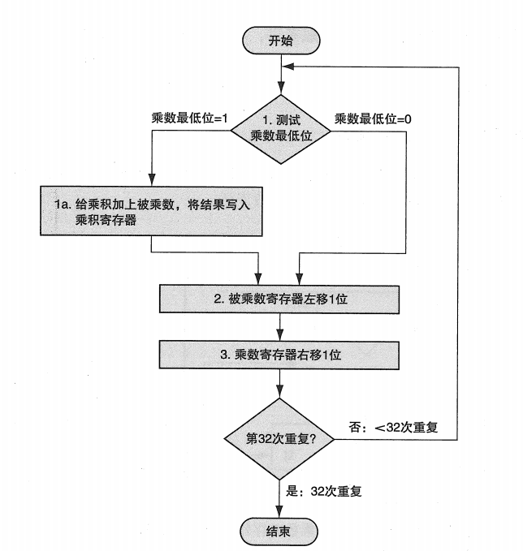

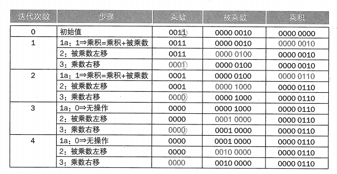

浮点数乘法：阶码（指数）相加，尾数相乘，规格化、舍入、规格化

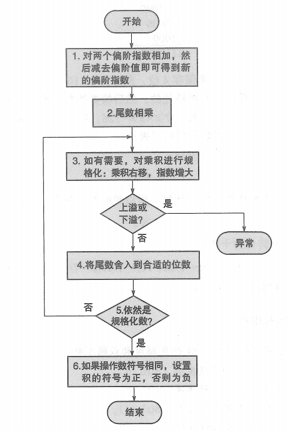

饱和算术：超过最大值或最小值时，取值为最大值或最小值

### 浮点表示：IEEE 754标准

**单精度（32位）：**

| s（符号位） | 指数               | 尾数 |
| ----------- | ------------------ | ---- |
| 1位         | 8位（偏移量为127） | 23位 |

(-1)^s^ × （1+尾数）× 2^指数-127^ （在浮点表示中隐含了一个1） 

**双精度（64位）：**

| s（符号位） | 指数                 | 尾数 |
| ----------- | -------------------- | ---- |
| 1位         | 11位（偏移量为1023） | 52位 |

小数部分的二进制表示：每次乘2，若个位为1，则该位记为1，否则记为0

浮点数的加法：先对阶（指数部分一致），再将尾数相加，最后规格化

## 第四章 处理器

（根据翼云图灵网课）

### 一、单周期数据通路：

#### 1.数字逻辑基础：

1. 组合逻辑：不含存储器，输入给定时输出也唯一确定
2. 时序逻辑：含存储器，至少两个输入（时钟、输入数据）
3. 边沿触发时钟：只有在时钟上升沿时才写入数据
4. 多路选择器：根据控制信号，从多个数据中选择一个作为输出
5. 总线：数据信息多于一位的信号线

#### 2.MIPS核心子集：

1. **R型指令：** add , sub , AND , OR , slt
2. 访存指令：**lw , sw**
3. 决策指令：**beq** , j

#### 3.指令周期：

1. **IF**（Instruction Fetch，取指令）
   + 根据PC（程序计数器）提供的地址，从这个地址的指令存储器中取出指令
   + 更新PC，PC = PC+4（每条指令占四个字节）
2. **ID**（Instruction Decode，指令译码与读寄存器）
   - 指令译码：根据操作码（opcode）确定指令类型（R型、I型、J型）。
   - 寄存器读取（根据指令类型）
   - 生成控制信号：如`RegDst`、`ALUSrc`、`MemtoReg`等。
3. **EX**（Execute，执行运算）
4. **MEM**（Memory Access）：
   + 访存：lw , sw
   + 分支：若分支条件成立（如`beq`），更新PC为目标地址；否则顺序执行
5. **WB** （Write Back，写回）

**不同指令的流水线示例**

| **指令类型** | **IF** | **ID**         | **EX**       | **MEM**          | **WB**         |
| :----------- | :----- | :------------- | :----------- | :--------------- | :------------- |
| **R型指令**  | 取指令 | 译码并读寄存器 | 执行算术运算 | 无操作           | 结果写回寄存器 |
| **lw指令**   | 取指令 | 译码并计算地址 | 计算内存地址 | 读取内存数据     | 数据写回寄存器 |
| **sw指令**   | 取指令 | 译码并计算地址 | 计算内存地址 | 写入内存数据     | 无操作         |
| **beq指令**  | 取指令 | 译码并比较值   | 计算分支地址 | 更新PC（若跳转） | 无操作         |

> 寄存器（Register）：用于临时存储CPU当前正在处理的数据、指令或地址。
>
> 存储器（Memory，通常指主存/RAM）：存储程序、数据及操作系统代码。

单周期实现中，CPI为1，每个指令都和lw指令花一样时长，时钟周期长（主要缺点）；多周期实现中，CPI为4或5，但时钟周期短（缩短到1/5），所以运行速度更快。

> 多周期：
>
> 拆分指令为多步骤，每步1个时钟周期，复用功能部件。
>
> 有限状态机（FSM）：每个状态对应一个执行阶段，输出控制信号（如`RegWrite`, `MemRead`）。
>
> 状态转换：根据当前状态和指令操作码（`opcode`）跳转到下一状态。
>
> 单周期按最慢指令设定周期；多周期按最慢**阶段**设定，阶段耗时远小于完整指令。

#### 4.MIPS核心子集数据通路：

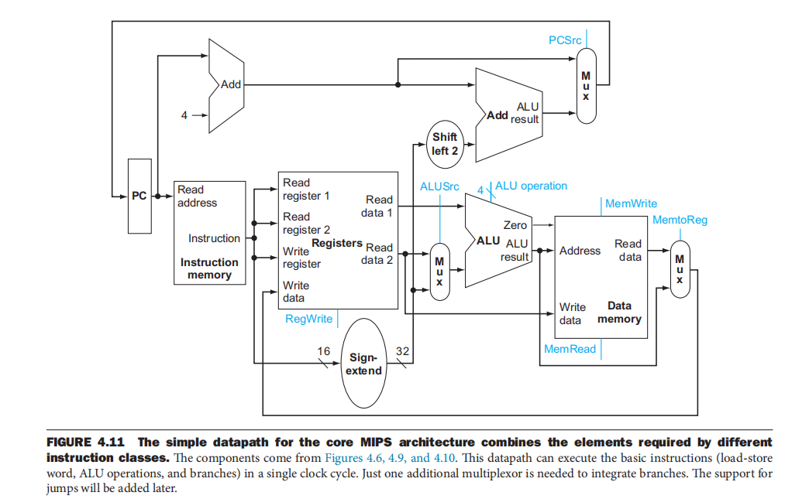

### 二、单周期控制单元：

#### 1.ALU控制单元

ALU控制线（4位）：决定ALU具体执行什么运算

ALU操作码（ALUOp）（2位）：主控制单元根据指令操作码，向ALU控制单元输出

| ALUOp | 指令    | 功能                                                     |
| ----- | ------- | -------------------------------------------------------- |
| 00    | 访存    | ALU将基址和偏移量相加（**0010**）（这4位是对应的控制线） |
| 01    | 分支beq | ALU将两源操作数相减（**0110**）<br />（若等于0说明相等） |
| 10    | R型     | 由funct字段进一步指定                                    |


flowchart LR
    主控制单元 --ALUOp--> ALU控制单元
    ALU控制单元 --若ALUOp=10--> funct字段
    funct字段 --> 主控制单元


多级译码：由ALUOp和R型指令中的funct字段共同决定ALU控制线

#### 2.控制信号

每个周期都会进行读操作，所以不需要读使能

**RegWrite **：只有R型和lw需要进行写（写回寄存器），所以需要写使能（而lw写回rt，R型写回rd，所以写回时需要加个多路选择器来选择目标寄存器——**RegDst**）

**ALUsrc **：ALU source，选择ALU的源操作数，为**1**时选取符号扩展后的<u>立即数</u>，为**0**时选取rt作为源操作数

**MemRead/MemWrite** ：只有lw读数据存储器（MemRead=1），sw写数据存储器（MemWrite=1）

**MemtoReg** ：决定从哪里写回寄存器，lw从存储器写回（MemtoReg=1），R型从ALU写回（MemtoReg=0）

**branch** ：选择目标地址写回PC（branch=1），选择PC+4写回分支（branch=0）,（加上ALU的`Zero`标志=1，rs-rt=0，PCsrc=1）

加上**ALUOp**，就是主控制单元发出的8个控制信号（共9位，因为ALUOp有两位），由ALUOp和R型的funct字段得到

指令译码：主控制单元将操作码翻译成控制信号并发送到对应器件

#### 3.带控制的MIPS核心子集数据通路

（一般会给一个，可能要修改）

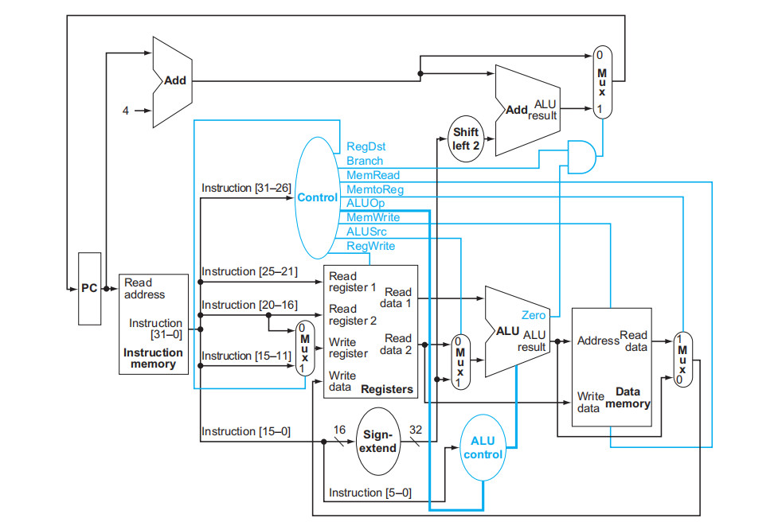

#### 4.指令控制信号表

| 指令    | RegDst | ALUSrc | MemtoReg | RegWrite | MemRead | MemWrite | Branch | ALUOp1 | ALUOp0 | jump |
| ------- | ------ | ------ | -------- | -------- | ------- | -------- | ------ | ------ | ------ | ---- |
| R型指令 | 1      | 0      | 0        | 1        | 0       | 0        | 0      | 1      | 0      | 1    |
| lw      | 0      | 1      | 1        | 1        | 1       | 0        | 0      | 0      | 0      | 1    |
| sw      | X      | 1      | X        | 0        | 0       | 1        | 0      | 0      | 0      | 1    |
| beq     | X      | 0      | X        | 0        | 0       | 0        | 1      | 0      | 1      | 1    |
| j       | X      | X      | X        | 0        | X       | 0        | 0      | X      | X      | 0    |

j指令（需掌握吗）需要一个控制信号jump（低电平有效）                                                                         

### 三、流水线数据通路与控制

#### 1.指令周期与流水级

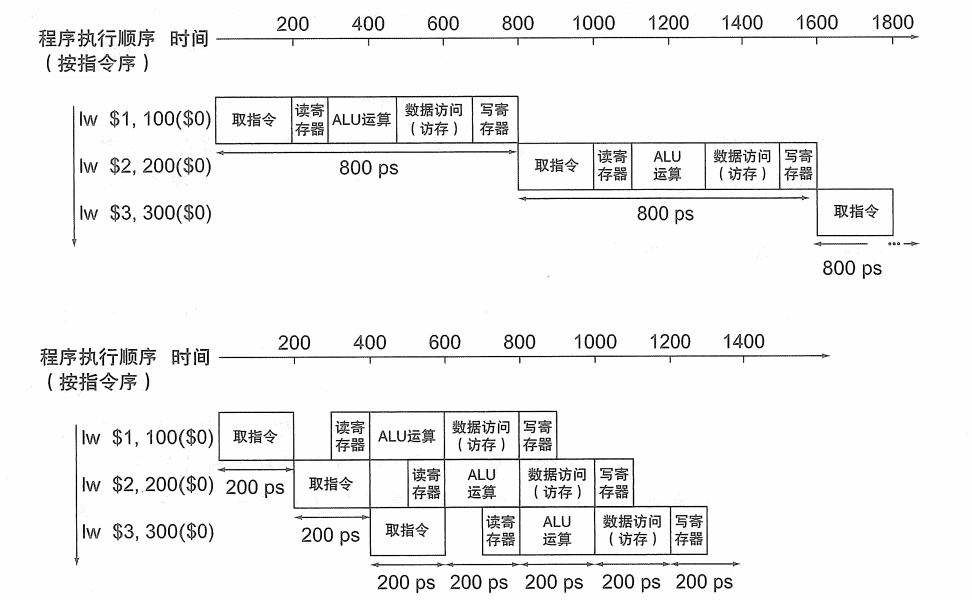

与指令周期的五个阶段相对应，把数据通路分为5个**流水级**，形成**流水线**（pipeline）

时钟周期数 = 指令数 + 流水级级数 - 1

理想加速比 = 流水级级数（理想条件：每个流水级时间等长；流水线没有开销；指令数足够大）

省略流水周期可能导致：结构冒险：两条指令抢占同一流水级的硬件部件（解决方法：添加硬件）

#### 2.流水线性能

流水线并不减少单条指令的执行时间，而是通过增加指令吞吐率来增加性能。即，在同一时间处理多条指令的不同阶段，实现**指令级并行**。

流水线和单周期相比，CPI均为1，指令数一致，主要就是减少了时钟周期（<u>适度</u>进一步划分流水级可以缩短时钟周期）。

吞吐率：评价流水线性能的重要指标。

#### 3.流水线寄存器

为了保留每条指令各自的数据，需要在流水级之间插入流水线寄存器，以左右两个流水级命名分别叫做IF/ID、ID/EX、EX/MEM、MEM/WB

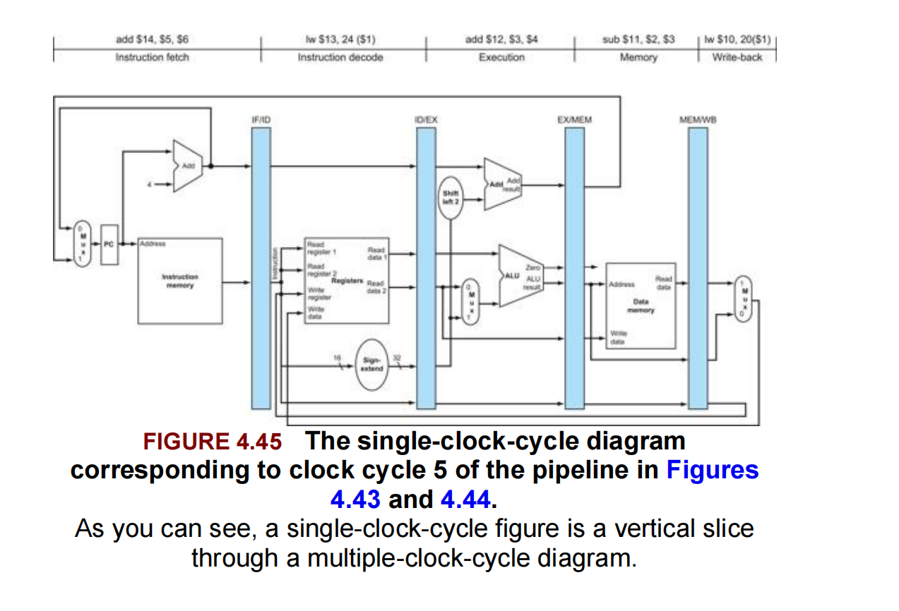

（对于状态/时序单元，左半边涂灰表示写入，右半边涂灰表示读取；组合单元涂灰表示使用）

#### 4.流水线分析：lw

1. IF（取指）：从PC取到指令的地址，由指令存储器读出指令内容，上面的add计算PC+4，这两部分内容会被这条指令的后续过程用到，所以要传给IF/ID
2. ID：每条指令都要译码产生控制信号，都要读寄存器。（对于beq，PC+4要留到第三个周期才能计算分支目标地址，所以PC+4要继续传给ID/EX）。指令译码读出了rs、rt的数据，这些要送给第三周期执行运算，因此也要给ID/EX。对lw而言，要立即数加上rs的基地址才得出取数地址，所以扩展后的立即数也要送入ID/EX
3. EX：ALU结果、零标志位，分支目标地址都要传给EX/MEM
4. MEM：从数据寄存区读的数据，ALU运算结果传给MEM/WB（rt的寄存器号也要一路传过来，用于将数据写回）
5. WB：将访存读取的数据写回寄存器堆

也就是后面要用到的数据，需要先存储在流水线寄存器中。

控制信号要一级一级传递，如果被使用了就不用继续传递了。

#### 5.流水线的冒险：数据冒险

后面的指令要读取到前面指令写回寄存器的值，但是前面指令还没写。

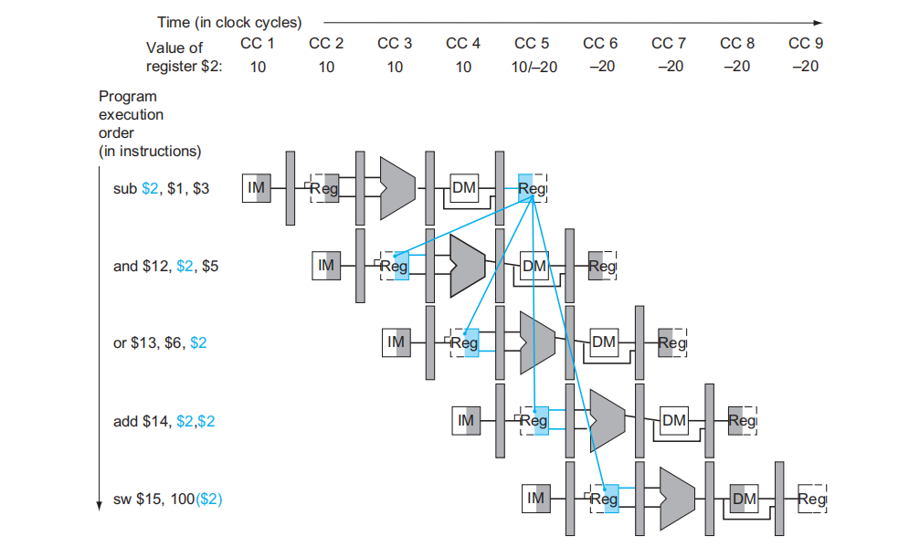

sub在CC5才将 -20 写入 `$v0`，and 和 or 在CC3/CC4就要读取 -20 ，此时`$v0`的值还是 10，于是产生了数据冒险。

##### 解决方法1：旁路

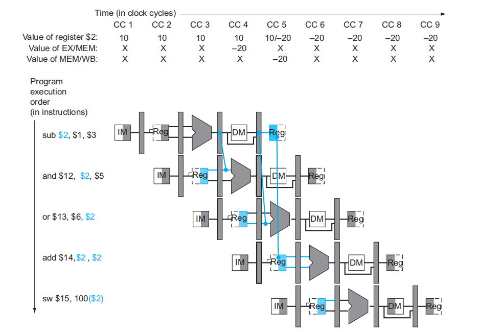

-20在CC3的ALU计算后就已经产生，所以可以从EXE/MEM寄存器中直接获取数据传给and指令的ALU（ALU-ALU旁路），从MEM/WB寄存器将数据传给or指令的ALU（MEM-ALU旁路），这种跳过寄存器写回、直接从流水线寄存器取得数据的方法称为转发或**旁路**。

同时有ALU-ALU旁路 和 MEM-ALU旁路 成为全旁路。

##### 解决方法2：阻塞

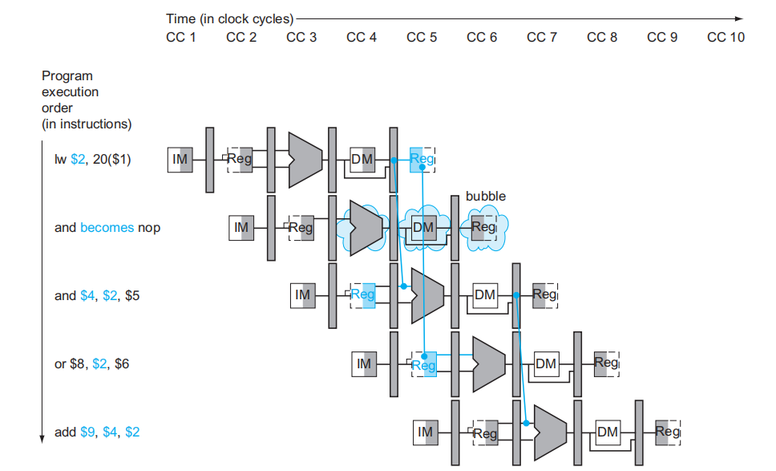

lw指令的数据在MEM级才产生，而在and指令的ALU就要用到，所以要在lw指令后添加一个气泡/阻塞周期：

将add的控制信号全部清零，将其变为空指令，同时将add指令的地址（PC+4-4）重新写回PC，在lw的EX周期重新执行add指令（以上过程由冒险检测单元实现）

#### 6.流水线的冒险：控制冒险

分支引发的控制冒险：如果分支成功的话要跳过一些指令，但是这些指令的一部分却被执行了

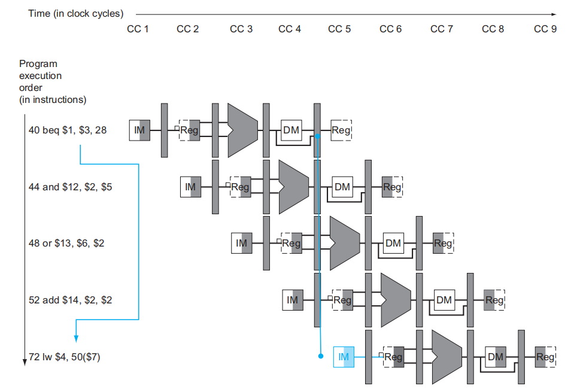

##### 解决方法1：分支预测

静态分支预测策略：采取总是假设分支不发生的策略，执行那些紧跟在beq后的指令

动态分支预测策略：保存近几次记录，预测分支是否发生（在分支比例不大不小时采取）

##### 解决方法2：缩短分支延迟

计算分支目标地址 + 判断分支条件（在ID级从寄存器堆中取出rs和rt数据送入一个相等检测单元，若相等则发送信号），在ID级就完成了分支

如果beq的上一条指令是R型指令，且需要比较R型指令的运算结果，则在旁路基础上还要阻塞一个周期；如果上一条是lw，则要阻塞两个周期（这是假设beq在ID阶段判断分支）

#### 7.带冒险控制的单周期流水线图

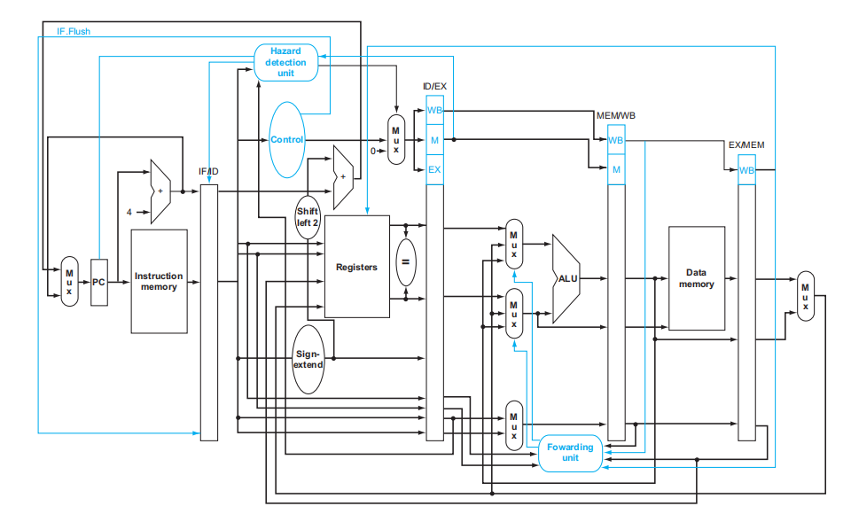

新增的：旁路单元；冒险检测单元（支持阻塞）；相等检测单元（register后的=）

## 第五章 存储器层次结构

### 一、存储器技术概要

时间局部性：某个数据被访问，很快会再次被访问

空间局部性：某个数据被访问，它附近的数据很可能被访问

### 二、高速缓存cache

#### 1.访存性能概念：命中与缺失

**计算平均访问延时**（命中的+不命中的）

访存：访问内存，分读取和写入

访存指令：MEM-reg数据传送指令 = L-S指令（lw和sw指令）

CPU访问内存时，都会优先询问cache是否保存着所需数据

命中：cache保存着所需数据

缺失：cache不包含所需数据

缺失率 = 1 - 命中率  MR = 1 - HR

#### 2.访问阻塞周期数

命中时间：CPU访问cache的时间（通常1T）

缺失代价：CPU访问内存比直接访问cache<u>多出来</u>的额外开销

为了评价存储器的性能，程序执行的周期数 = CPU执行周期数 + 访存阻塞周期数

访存阻塞周期数 = 访存次数 * 缺失率 * 缺失代价

#### 3.直接映射

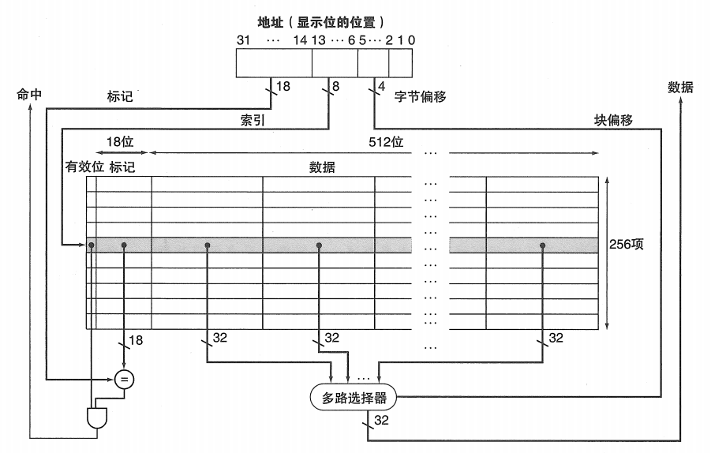

**块号**

cache块号 = 内存块号%cache块数

对2^n^ 块的cache， cache块号 = 内存二进制块号的后n位（是块号，最后两位不算块号）

**内存地址字段**

cache块号之后：块内（字节）偏移

cache块号：索引位

cache块号之前：标记位

##### cache位数计算

例、一个有16KB数据的cache，块大小为4个字，地址为32位，该cache总共多少字节？cache总容量是实际数据容量的多少倍？

一个cache：有效位 + 地址标记 + 数据

块大小为4个字 -> 16B -> 2^4^ -> 块内字节偏移：4位（低4位）-> 内存块号：高28位（其中低n位为cache块号）

16KB数据 ->cache中的数据域为16KB

计算cache有多少块：数据16KB / 块大小16B = 1k = 1024 = 2^10^ ，cache有10块，标记位：28-10 = 18

cache总共多少字节： （1（有效位） + 标记位 + 数据）* 行数 = （1 + 18 + 128（4个字=16个字节= 128位））* 行数（cache块数=1024） =  147KB = 18.375k字节（1字节8位）

多少倍：18.375 / 16 

##### 缺失分类

1. 首次访问cache中没有的块必然产生的缺失（冷启动强制缺失）
2. cache容量不能容纳程序执行需要的所有块，部分块被替换后再次调入cache（容量缺失）
3. 多个内存块竞争映射到同一个cache块导致仍需使用的块被替换（冲突碰撞缺失）

以上是3C模型

##### cache访问缺失处理的步骤

1. 将PC + 4 - 4（即当前指令的地址）写回PC，并阻塞处理器（等待这次访存结束）
2. 访问内存，将内存块写入cache
3. 再次访问cache并命中

写策略：

1. 写直达：数据写入 cache 的同时，也立即写入下一层

2. 写回：数据先只写入 cache，等被替换出 cache 时再写回到下一层

写分配策略（写命中失败时的策略）：

1. 写分配：先把数据块从主存调入 cache，再写入 cache。

2. 不写分配：直接把写数据写入下一层 cache/主存，不加载到 cache。

#### 4.相联映射

##### 全相联映射

内存块可能映射到任何一个cache块

如果cache已满，则替换掉最长时间没用过的内存块（最近最少使用，LRU）

没有碰撞缺失 -> 容量缺失

适用于块数较少的cache

##### 组相联映射

对cache块进行分组，一个内存块<u>直接映射</u>到一个组，在组内部<u>全相联</u>

一组包含n块 则称为n路组相联，其相联度为n

cache组号 = 内存块号 % cache组数

对2^n^ 组的cache，cache组号 = 内存二进制块号的后n位

替换策略：最近最少使用

全相联、组相联cache总位数的计算

#### 5.降低缺失代价：多级cache

全局缺失率，局部缺失率（类比打鱼）

#### 6.cache性能评价

平均访存时间（AMAT）：命中时间 + 缺失率*缺失代价（只考虑访存指令的时间）

CPI：总周期数 / 总指令数

> AMAT = Hit time + Miss rate × Miss penalty
>
> AMAT = Cache 命中时访问所需时间 + 缺失率 * Cache 缺失后从下一层（或内存）中取数据所需的时间
>
> CPI = CPI_base + Memory_stall_cycles_per_instruction
>
> Memory_stall_cycles_per_instruction = （访存指令占比 + 1） × (AMAT - Hit_time)
>
> 加1是因为所有指令都要取指

*多核CPU中的cache一致性（没看懂）

（二）最后有复习题

### 三、虚拟存储器

#### 1.虚拟地址转换为物理地址

内存是磁盘的cache

页（page）：磁盘和内存之间交换的块

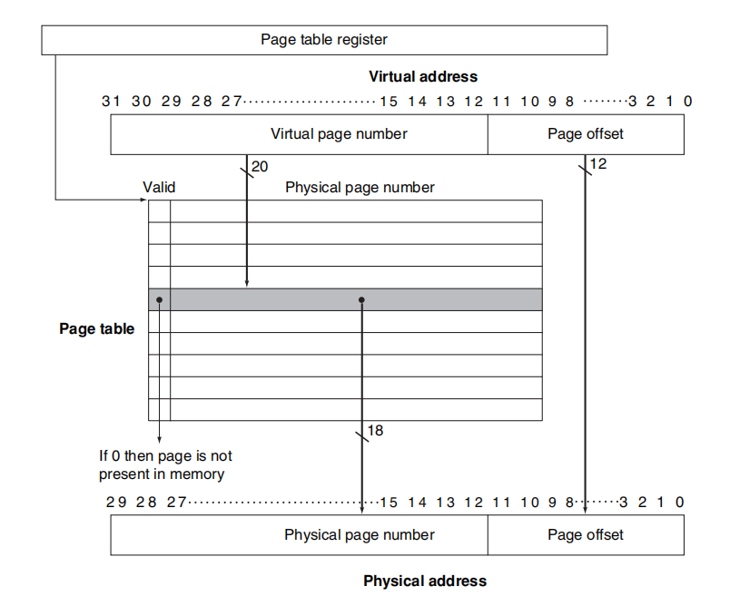

对4kb的页，需要2^12^ 位表示页内偏移（虚拟地址和物理地址的页内偏移是一一对应的）

剩下来的就是虚拟页号（32-12=20）和物理页号（30-12=18）

虚拟页号通过查询<u>页表</u>（page table）映射到物理页号

页内偏移和物理页号拼接形成物理地址

每个进程都有一张页表，存放在自己的内存空间，页表首地址放在<u>页表寄存器</u>（页表指针）中，<u>页表项</u>记录了每个虚拟地址对应的物理地址，有多少个虚拟页号一张页表就有多少项

访问页不在内存中时（有效位为0），产生一次<u>缺页</u>，需要读取磁盘用于扩充物理内存的部分即<u>交换区</u>

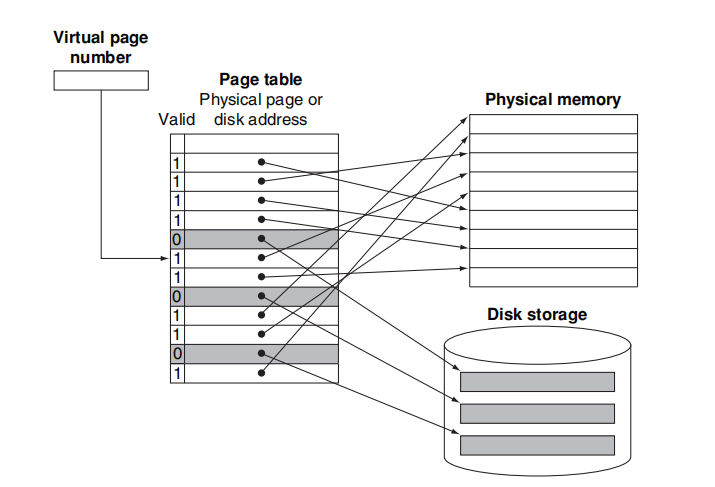

#### 2.替换策略 写策略

引用位：近似实现LRU（LRU只在全相联和组相联中有涉及）

脏位：判断是否写回

#### 3.TLB快表

CPU访存时，先用虚拟地址读取页表，得到物理地址，再进行真正访存，为了加快读取页表得到物理地址的访存，引入了页表的cache，即TLB

TLB只保存部分页号的映射信息

虚拟页号填在TLB的标记位字段中

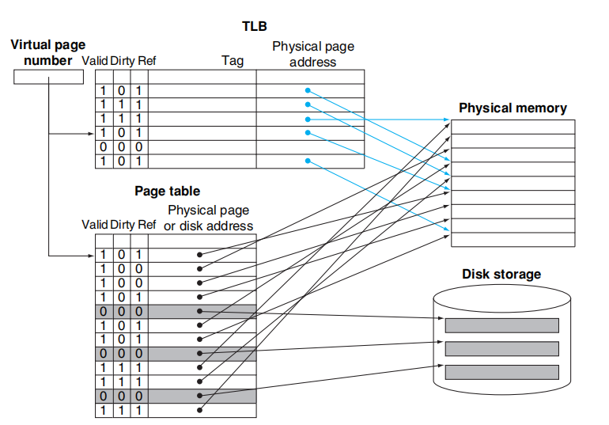


完整访存过程：

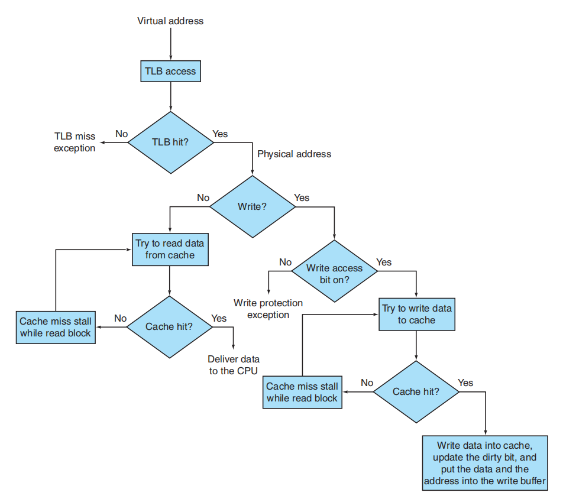


#### 4.地址翻译与数据访问全流程

1. **CPU 发出虚拟地址**  
   → 首先查询 **TLB**（Translation Lookaside Buffer）。

2. **TLB 查询结果**：
   - **命中**：  
     - 直接获得物理地址 → 跳到步骤 4。
   - **缺失**：  
     - **访问页表**（存储于内存中）→ 
       - **若页表项存在（有效）**：  
          - 获得物理地址，并更新 TLB → 跳到步骤 4。
       - **若页表项不存在（缺页）**：  
          - 触发 **缺页异常（Page Fault）** → 
             - 操作系统介入：从磁盘加载缺失页到内存  
             - 更新页表项和 TLB  
             - 重新执行导致缺页的指令 → 重新开始流程。

3. **生成物理地址**  
   （来自 TLB 或页表）

4. **用物理地址访问 Cache**：
   - **Cache 命中**：  
     - 直接返回数据给 CPU → 流程结束。
   - **Cache 缺失**：  
     - 访问 **内存** 读取数据 →
        - 将数据所在整个 **Cache 块（Block）** 载入 Cache  
        - 返回目标数据给 CPU。

📌 总结流程图


graph LR
A[CPU 虚拟地址] --> B{TLB 命中？}
B -- 是 --> C[获得物理地址]
B -- 否 --> D[访问页表（内存）]
D --> E{页表项有效？}
E -- 是 --> F[更新 TLB] --> C
E -- 否 --> G[缺页异常] --> H[磁盘加载数据到内存] --> I[更新页表] --> F
C --> J{访问 Cache}
J -- 命中 --> K[返回数据]
J -- 缺失 --> L[访问内存] --> M[载入 Cache 块] --> K



1. **页表查询失败 ≠ 直接访问内存数据**，而是触发缺页异常（涉及磁盘 I/O）。  
2. **内存访问仅在两种场景出现**：  
   - TLB 缺失时访问页表（读内存）  
   - Cache 缺失时加载数据块（读内存）  
3. **磁盘参与**：仅当缺页异常发生时，由操作系统从磁盘加载数据。

> 完整链条：**CPU → TLB → 页表（内存）→ 物理地址 → Cache → 内存 → 磁盘**

## 第六章 IO和并行处理器

总线（Bus）是计算机系统中**共享的通信链路**，用于连接处理器、内存、I/O设备等子系统，通过一组共享的物理线路传输数据、地址和控制信号。

主从模式：

- **主设备（Master）**：发起事务（如CPU、DMA控制器）
- **从设备（Slave）**：响应请求（如内存、磁盘控制器）

访问方法：仲裁机制（菊花链 `简单；低优先级设备可能“饿死”` vs 集中式 `公平高效` ）、事务阶段（请求→仲裁→传输）。

> **事务流程**
>
> 1. **请求阶段**：主设备申请总线使用权（`BusReq`信号）。
> 2. **仲裁阶段**：仲裁器授权（`BusGrant`信号）。
> 3. **传输阶段**：
>    - **地址阶段**：主设备发送目标地址。
>    - **数据阶段**：读写数据（可能多周期突发传输）。

总线握手协议

1. **同步总线**

- **特征**：由全局时钟驱动，信号在时钟边沿采样。

- **时序示例**：

  ```
  时钟周期1：主设备发地址 + 命令（Read/Write）  
  时钟周期2：从设备准备数据  
  时钟周期3：数据稳定传输  
  ```

- **缺点**：时钟偏移限制总线长度和速度。

2. **异步总线**

- **特征**：无全局时钟，依赖**握手信号**（`Req`/`Ack`）协调传输。（也就是主设备发出了请求信号，并且从设备接受了请求信号，则写。两个都撤销了，则结束）
- **写操作流程**（PPT 31页）：
  1. 主设备置地址/数据 → 置`Req=1`（请求传输）。
  2. 从设备接收数据 → 置`Ack=1`（确认完成）。
  3. 主设备撤销`Req` → 从设备撤销`Ack`（结束事务）。
- **优点**：适应不同速度设备，支持长距离传输。

> 🔍 **关键区别**：同步总线“定时发送”，异步总线“协商发送”。

直接存储器访问方式 (Direct Memory Access, DMA)：

- 原理： 引入专用硬件控制器 (DMA 控制器)。 当需要传输大量数据（如磁盘读写）时，CPU 初始化 DMA 控制器（告知数据位置、大小、设备），然后继续执行程序。DMA 控制器接管总线，直接在 I/O 设备和内存之间传输数据。传输完成后，DMA 控制器中断 CPU 告知结果。
- 特点： 数据传输过程 CPU 基本不干预，只在开始和结束时参与。 极大解放 CPU。适合高速、大批量数据传输。
- 优缺点： 传输速率高，CPU 负担轻；需要额外的 DMA 控制器硬件，控制逻辑复杂。


